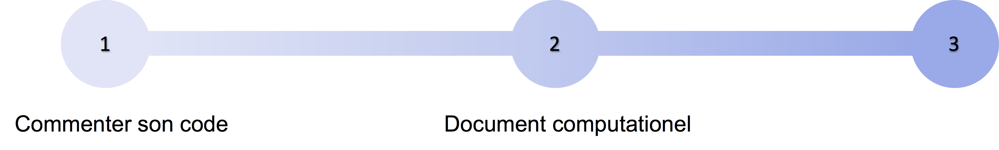

# Rendre son code compréhensible {#C-code-good}

> "*Programs must be written for people to read, and only incidentally for machines to execute*."   
> -- Harold Abelson
  
Les chapitres précédents (et en particulier 
le chap.8 "Des problèmes de calculs" [bien mettre le renvoi vers ce chap.8]) 
ont souligné l'importance des questions de diffusion et de partage des codes informatiques. 
Une étape préalable à cette démarche est de rendre son code facilement 
compréhensible par un lecteur externe. 
Ce premier lecteur peut être un collègue, comme vous-même : ce qui était clair au moment de la rédaction l'est nettement moins après quelques semaines. 

Il existe là encore différents degrés de complexité permettant de faciliter 
la compréhension de son code : 

 1. nommer ses variables et ses fonctions de manière informative
 2. être explicite
 3. commenter son code
 4. documenter son code
 5. utiliser des documents computationnels
 6. restructurer et automatiser avec un *workflow*

<!--


> FIXME diagramme à refaire en plus joli et à améliorer *ECG*

> FIXME Il manque dans ce chapitre des sous-sections "Pour en savoir plus {-}"

-->

## Nommer ses variables et ses fonctions de manière informative

> "*There are only two hard things in Computer Science: cache invalidation and naming things*."  
> -- Phil Karlton

Une manière d'obtenir un code plus facile à comprendre par un observateur extérieur 
est d'utiliser des noms informatifs qui explicitent directement ce que représente une 
variable ou une fonction. C'est une tâche qui peut se révéler étonnamment ardue !
Lisez le code suivant et essayez de comprendre ce à quoi il peut bien servir par exemple : 

```R
ninja = 100
XX = 2.0000
a = 0.5
turtle = 3.2
bluE_Pizza = a * ninja * turtle ** XX
print(bluE_Pizza)
```

Vous avez trouvé ? Pas encore ? Cet exemple est créé de toutes pièces mais nous avons 
tous déjà rencontré des codes bien pires que ça. Ces quelques lignes sont pourtant
rigoureusement équivalentes au code suivant :

```R
mass = 100
speed = 3.2
energy = 1/2 * mass * speed^2
print(energy)
```

Dans le code qui précède, le nom des variables est parfaitement clair 
et le code se passe alors de commentaire.

Une autre manière de rendre son code plus lisible est de le modulariser en créant 
des fonctions aux noms explicites qui permettent  :

- à la fois de le rendre robuste, en évitant les répétitions d'instructions et minimisant ainsi le nombre d'erreurs, 
- mais aussi de le condenser et donc de le rendre plus lisible
<!-- Cette approche de *Don't Repeat Yourself* est un principe qui s'oppose à *Write Everything Twice*. -->

Dans le cadre de cette modularisation, il vous faudra également bien réfléchir 
à la portée de vos variables (variable locale ou globale)
et aux paramètres de vos fonctions afin d'éviter autant que possible les variables 
globales, les effets de bord étant une source de confusion et d'erreur inépuisable. 

Pour limiter au maximum les erreurs dans un code, il faut donc essayer de l'écrire
de façon à la fois claire, non ambigüe, commentée et concise. 
Lorsqu'on débute en programmation, c'est étonnamment difficile à faire 
car il faut s'adapter au style du langage utilisé. 
Il faut en effet intégrer les concepts essentiels du langage de programmation 
pour exprimer ce que l'on souhaite faire de la manière la plus élégante possible. 

Nous parlerons dans le chapitre suivant de techniques et conseils 
pour rendre son code plus robuste. 
Mais avant même cette étape, nous pouvons déjà agir sur le processus d'écriture.

## Etre explicite

Tim Peters a écrit *The Zen of Python* (que vous pouvez lire en saisissant
`import this` dans une session Python) qui donne un ensemble de règles qu'il
faut garder en tête lorsqu'on écrit un programme. 
Les six premières lignes sont :

> *Beautiful is better than ugly*  
> *Explicit is better than implicit*  
> *Simple is better than complex*  
> *Complex is better than complicated*  
> *Flat is better than nested*  
> *Sparse is better than dense*

Ces six conseils peuvent paraître plus ou moins évidents à mettre en œuvre pour un
débutant, mais focalisons-nous sur le deuxième. Il peut être mis en
œuvre très simplement en refusant par exemple l'usage des "arguments par
défaut". "Arguments par défaut" signifie que lorsque vous appelez une fonction qui
nécessite normalement *n* paramètres, vous appelez celle-ci avec
un nombre réduit *k* < *n* paramètres, et les valeurs des *n-k* paramètres manquants 
sont complétées automatiquement avec celles définies par défaut dans la fonction. 
C'est bien pratique : vous économisez de l'écriture de code, mais en vous 
reposant sur cette fonctionnalité, vous laissez implicitement à la bibliothèque
utilisée le soin de définir à votre place la valeur des paramètres. 
La plupart du temps, déléguer votre responsabilité à un tiers ne pose pas de problème majeur... jusqu'au jour où, après une mise à jour, la valeur d'un de ces *n-k* paramètres par défaut est changée ! 
Vos résultats changent, alors que votre programme n'a pas changé d'un bit. 
Le problème aurait pu être évité : vous auriez pu expliciter l'ensemble de vos *n* paramètres, 
y compris les éléments non obligatoires car disposant d'une valeur par défaut.

## Commenter son code

Commenter son code de manière pertinente est une tâche moins évidente qu'il n'y paraît.
Il ne s'agit pas de décrire dans une langue comprise par les humains 
ce que le programme effectue, comme nous allons le voir. 
Considérons le programme suivant :

```R
ninja = 100    # This is the mass. It is expressed in kilograms.
XX = 2.0000    # This is the exponent
a = 0.5        # This is a magical constant
turtle = 3.2   # This corresponds to the speed at which the ninja is moving [m.s-1]
# Now I will use the famous kinetic energy formula, which is of course only valid for a non-rotating object.
bluE_Pizza = a * ninja * turtle ** XX
print(bluE_Pizza) # Now, let's print it on the screen
```

Les commentaires ci-dessus n'aident pas vraiment à comprendre
de quoi il retourne ; la version du code avec des noms de variables
explicites est bien plus simple à comprendre. 
On pourrait toutefois objecter cet argument : un code bien écrit se passe de commentaires. 
Il s'avère que les commentaires de l'auteur du code s'adressent à son lecteur, 
censé connaître à la fois le langage utilisé et le contexte du logiciel. 
Les commentaires servent par exemple à signaler : 

- les unités ou le domaine de définition d'une variable toujours positive, 
- une ruse de calcul,
- un point un peu délicat qui devrait être amélioré, 
- les conditions particulières dans lesquelles une fonction doit ou ne doit pas être
utilisée, 
- la raison de l'assignation d'une nouvelle valeur à une variable 
dans les données, etc. 

Les commentaires attirent l'attention du lecteur et répondent de manière anticipée à une partie de ses questions.

Enfin, il est possible d'atténuer l'austérité de cette tâche en commentant son code au fur et à mesure de sa rédaction. 
Si commenter du code peut sembler à peu près aussi attractif que de se faire un tatouage sur le visage quand on ne souhaite pas embrasser une carrière dans le *hip hop*, on se rend pourtant compte de l'utilité de cette tâche une fois face à des lignes écrites plusieurs mois, voire plusieurs semaines auparavant. 

## Documenter son code

Le commentaire s'adresse au programmeur qui
va chercher à comprendre ou à faire évoluer le code (_cf._ ci-dessus).
La documentation s'adresse quant à elle aux utilisateurs du logiciel. 
Cela commence en général par un fichier `README` expliquant succinctement
l'objectif du logiciel, comment l'installer, comment l'exécuter. 
Au fur et à mesure que le code évolue, sa documentation peut devenir plus
conséquente et, dans ces cas, cette documentation s'intègrera souvent directement 
dans le code source grâce à des outils comme Sphynx (pour Python) ou Roxygen (pour R). 
Il est donc important de bien faire la distinction entre ces deux
types d'annotations (commentaire et documentation) qui peuvent se retrouver simultanément
à l'intérieur du code.

## Utiliser des document computationnels (*notebooks*)

La programmation lettrée a été conceptualisée en 1984 par Donald Knuth
[@knuth1984literate] *SG* et propose des principes pour produire un
code compréhensible. Il s'agit principalement de considérer l'écriture d'un code comme un
moyen d'expliquer à d'autres personnes les tâches demandées à
l'ordinateur. 
À l'époque, l'objectif était d'autoriser les développeurs
à s'affranchir de l'ordonnancement imposé par l'ordinateur et de se
concentrer sur leur pensée.

Dans le cas d'un chercheur, l'enjeu se concentre sur l'exécution du code : 
les données d'entrées et les résultats obtenus permettent d'enrichir la compréhension du phénomène étudié. 

Les documents computationnels 
ou *notebooks* s'inspirent d'une certaine façon de la programmation lettrée 
et proposent une manière de travailler devenue très populaire parmi les chercheurs. 

Les documents computationnels permettent d'intégrer dans un même 
document : du texte rédactionnel, du code informatique
et les résultats de ce code. 
La partie narrative, rédigée dans un langage de balisage très léger 
(tels que [Markdown](https://daringfireball.net/projects/markdown)), 
est régulièrement agrémentée de fragments de codes exécutables 
(par exemple en R ou en Python) dont les résultats textuels ou graphiques 
sont automatiquement accolés. 
Cette structure correspond assez bien à la démarche suivie quotidiennement par
les chercheurs : 

  1. "Je propose une hypothèse que je décris" = partie narrative
  2. "Je réalise une expérience/analyse" = j'exécute mon programme
  3. "J'inspecte le résultat de mon expérience/analyse" = le résultat du programme
  4. "J'interprète les résultats et je décris mon interprétation" = partie narrative avant de proposer une nouvelle hypothèse

> FIXME: On pourrait peut-être insérer ici une illustration tirée du  [slide 37](https://gitlab.inria.fr/learninglab/mooc-rr/mooc-rr-ressources/blob/master/module2/slides/C028AL_slides_module2-fr-gz.pdf)
> [SVG](https://gitlab.inria.fr/learninglab/mooc-rr/mooc-rr-ressources/blob/master/module2/slides/img/example_pi_full.svg)

Ce procédé permet ainsi de documenter chaque étape de la recherche : chaque partie du code 
est gérée de manière indépendante et de fait, liée à sa finalité directe.
Différents outils permettent d'écrire de tels documents, les plus matures étant :

 - [Jupyter](https://jupyter.org)
 - [Rmarkdown](https://rmarkdown.rstudio.com)
 - [Org-mode](https://www.orgmode.org/fr)
 
De tels documents computationnels offrent de nombreux avantages : 

- d'une part ils permettent une meilleure transparence du code 
effectivement exécuté,
- d'autre part, ils facilitent sa compréhension car le code devient une partie intégrante d'une trame narrative ; certains *notebooks* peuvent ainsi quasiment s'apparenter à des articles,
- enfin, ces documents peuvent répondre à des besoins de traçabilité en raison de leur caractère dynamique : on obtient en effet des cellules de codes prototypes qu'il est possible de réécrire et de réexécuter avec des paramètres différents.  

Pour en savoir davantage sur les documents computationels, vous pouvez vous rapporter aux
module 2 et 3 du [MOOC sur la recherche
reproductible](https://learninglab.inria.fr/mooc-recherche-reproductible-principes-methodologiques-pour-une-science-transparente/).
*SG*

## Restructurer et automatiser l'exécution du code avec un *workflow*

Nous avons déjà évoqué l'importance de modulariser son code pour le
rendre plus compréhensible et plus facile à faire évoluer. 
Il existe de nombreux concepts pour vous permettre d'y arriver :
la programmation fonctionnelle, la programmation orientée objet, 
les *design patterns*, etc. 

Dès lors qu'il est question de transformer des
quantités importantes de données par des calculs complexes, le concept de 
[systèmes de *workflows* scientifiques](https://en.wikipedia.org/wiki/Scientific_workflow_system)
trouve toute sa pertinence. 
Il existe de nombreux *workflows* répondant aux besoins de 
différentes communautés scientifiques : astrophysique, génétique, etc. 

Lorsque votre *notebook* se stabilise mais devient trop long et trop complexe, il sera 
certainement temps de le restructurer. 
Les *workflows* peuvent vous y aider et vous permettre de passer 
par la même occasion à une étape supérieure d'automatisation de 
son exécution : c'est d'ailleurs souvent la motivation principale 
des utilisateurs de *workflows*.

Les *workflows* sont également des éléments à archiver pour rendre
ses travaux reproductibles.

## Pour en savoir plus

Le sujet des *workflows* est développé dans un webinar [*Reproducible Science in Bioinformatics: Current Status, Solutions and Research Opportunities*](https://github.com/alegrand/RR_webinars/blob/master/6_reproducibility_bioinformatics/index.org).

